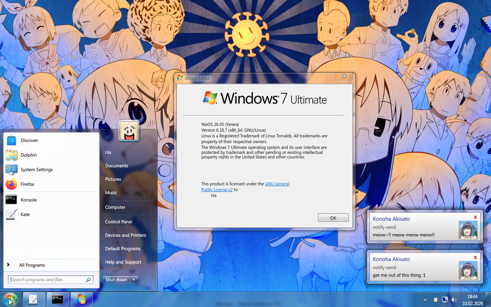

# AeroThemePlasma on NixOS
This [flake](https://wiki.nixos.org/wiki/Flakes) can be used to install [AeroThemePlasma](https://gitgud.io/wackyideas/aerothemeplasma) (Wayland) on a NixOS unstable system. The theme is installed system-wide and the user is expected to enable it imperatively by following the  [upstream instructions](https://gitgud.io/wackyideas/aerothemeplasma/-/blob/master/INSTALL.md#configuring-aerothemeplasma-).

There's also a bonus **experimental** module based on [plasma-manager](https://github.com/nix-community/plasma-manager) that can auto-apply the theme, fonts, shortcuts, and more.. but there are some [rough edges](#why-is-the-plasma-manager-module-experimental), if you're not comfortable with that, just stick to system-wide.



## Installation
### Fonts
Skip this section if you don't want to use `aerothemeplasma.fonts.enable` (required for the Plymouth theme).

Please get some font files from an up-to-date install of Windows 7. To check the version of a font with fontconfig, use `fc-query -f "%{fontversion}" FILE.ttf`. The expected files from C:\Windows\Fonts are as follows:

* Segoe UI: segoeui.ttf (336200), segoeuib.ttf (336200), segoeuii.ttf (336200), seguisb.ttf (327680)
* Lucida Console: lucon.ttf (327680)

Add the font files to the Nix store with `nix store add-file FILE.ttf`.

### Modules
Add aerothemeplasma-nix as a flake input and NixOS module. 

If using plasma-manager, also add home-manager and plasma-manager as flake inputs, then add home-manager's NixOS module, and plasma-manager & aerothemeplasma-nix's home modules as home-manager imports.

<details>
<summary>Example without plasma-manager</summary>

```nix
# ./flake.nix
{
  inputs = {
    nixpkgs.url = "github:nixos/nixpkgs/nixos-unstable";
    aerothemeplasma-nix = {
      url = "github:nyakase/aerothemeplasma-nix";
      inputs.nixpkgs.follows = "nixpkgs";
    };
  };
  
  outputs = inputs@{ nixpkgs, aerothemeplasma-nix, ... }: {
    nixosConfigurations.hostname = nixpkgs.lib.nixosSystem {
      system = "x86_64-linux";
      modules = [
        ./configuration.nix
        aerothemeplasma-nix.nixosModules.aerothemeplasma-nix
      ];
    };
  }
}
```

</details>

<details>
<summary>Example with plasma-manager</summary>

```nix
# ./flake.nix
{
  inputs = {
    nixpkgs.url = "github:nixos/nixpkgs/nixos-unstable";
    home-manager = {
      url = "github:nix-community/home-manager";
      inputs.nixpkgs.follows = "nixpkgs";
    };
    plasma-manager = {
      url = "github:nix-community/plasma-manager";
      inputs.nixpkgs.follows = "nixpkgs";
      inputs.home-manager.follows = "home-manager";
    };
    aerothemeplasma-nix = {
      url = "github:nyakase/aerothemeplasma-nix";
      inputs.nixpkgs.follows = "nixpkgs";
    };
  };
  
  outputs = inputs@{ nixpkgs, home-manager, plasma-manager, aerothemeplasma-nix, ... }: {
    nixosConfigurations.hostname = nixpkgs.lib.nixosSystem {
      system = "x86_64-linux";
      modules = [
        ./configuration.nix
        aerothemeplasma-nix.nixosModules.aerothemeplasma-nix
        home-manager.nixosModules.home-manager {
          home-manager = {
            useGlobalPkgs = true;
            useUserPackages = true;
            users.username.imports = [
              ./home.nix
              plasma-manager.homeModules.plasma-manager
              aerothemeplasma-nix.homeModules.aerothemeplasma-nix
            ];
          };
        }
      ];
    };
  }
}
```

</details>

### Configuration
To install the system components, add this to your NixOS configuration:
```nix
# ./configuration.nix
boot.plymouth.enable = true;
services.displayManager.sddm.enable = true;
services.desktopManager.plasma6.enable = true;
services.displayManager.defaultSession = "aerothemeplasma"; # if you want

aerothemeplasma = {
  enable = true;
  plasma.enable = true;
  fonts.enable = true;
  plymouth.enable = true;
  sddm.enable = true;
};
```

If you are using plasma-manager, drop `aerothemeplasma.plasma.enable` in favor of putting this in your home-manager configuration:

```nix
# ./home.nix
programs.plasma.enable = true;
aerothemeplasma = {
  enable = true;
  plasma.enable = true;
  fonts.enable = true;
};
```

### Use it
Rebuild and reboot your system. In SDDM, select "AeroThemePlasma (Wayland)" if not the default, which is in the button in the bottom left when using the theme. Follow the [configuration steps](https://gitgud.io/wackyideas/aerothemeplasma/-/blob/master/INSTALL.md#configuring-aerothemeplasma-) if not using plasma-manager. 

If you are using plasma-manager, some options may not apply until you log in a second time.

## Potential questions
### Why is X11 unsupported?
[Plasma's X11 session will be dropped in 2027.](https://blogs.kde.org/2025/11/26/going-all-in-on-a-wayland-future/) There are [some minor issues](https://gitgud.io/wackyideas/aerothemeplasma/-/blob/master/DOCUMENTATION.md#current-wayland-issues-) with using AeroThemePlasma on Wayland, but for the most part it works nicely, so I don't want to double the flake surface for something that is going away soon.

### Why did tooltips break after restarting `plasmashell`?
Under the AeroThemePlasma session it's called `aeroshell`, so you should restart that instead. If you use `plasmashell`, it will start without the tooltip patch.

### Why is the plasma-manager module experimental?
No shade to the plasma-manager developers as these may be Plasma limitations, but two reasons make me uncomfortable to make it the recommended option. Engage the yappatron:

#### Declarative window rules hide imperative ones
The opt-in `programs.linver.enable` comes with a window rule. When any window rule is added to [`programs.plasma.window-rules`](https://nix-community.github.io/plasma-manager/options.xhtml#opt-programs.plasma.window-rules), the list of window rules is set exclusively to the ones in it, so the imperative ones appear deleted (but they remain in the `kwinrc` file).

If you have window rules, you may want to migrate them to that option regardless.

#### No per-shell declarative panels
AeroThemePlasma includes a ["shell plugin"](https://wackyideas.neocities.org/blogposts/2025/11/15/kde-custom-shells) for Plasma. These get their own settings file storing their [containments](https://develop.kde.org/docs/plasma/scripting/api/#containments-desktops-and-panels), while most other settings are shared across shell plugins. Relevantly, the contents of a "[panel](https://develop.kde.org/docs/plasma/scripting/api/#panels)" containment are stored in the shell plugin's file, while the properties of the panel itself are stored in `plasmashellrc`.

Meanwhile, [plasma-manager's panel script](https://github.com/nix-community/plasma-manager/blob/fe54ea85c6e4413fba03b84d50f2b431d2f7c831/lib/panel.nix#L16) does not have a way to specify the panel type or restrict the panel to specific shell plugins. Panels set in [`programs.plasma.panels`](https://nix-community.github.io/plasma-manager/options.xhtml#opt-programs.plasma.panels) will overwrite the panels of any shell plugin the script runs under, causing unexpected data loss when they could be stored separately.

My "workaround" is to prevent use of [`programs.plasma.panels`](https://nix-community.github.io/plasma-manager/options.xhtml#opt-programs.plasma.panels) and let shell plugins set up their panels imperatively. Since the panel properties are stored in `plasmashellrc`, [`programs.plasma.overrideConfig`](https://nix-community.github.io/plasma-manager/options.xhtml#opt-programs.plasma.overrideConfig) deletes them, so it is also prevented.

### Why is this section called "Potential questions"?
I can't call them frequently asked questions when I haven't been asked them a single time yet!

## Special thanks
* [WackyIdeas](https://github.com/WackyIdeas) and contributors for developing [AeroThemePlasma](https://gitgud.io/wackyideas/aerothemeplasma)
* [meowkatee](https://gitgud.io/meowkatee) for suggesting the use of `LD_PRELOAD` [on a merge request for AUR packages](https://gitgud.io/wackyideas/aerothemeplasma/-/merge_requests/11#note_1759476)
* [aean0x](https://github.com/aean0x/.dotfiles/tree/20a3dd32b3ddbd752c93c9f38e03e76dbbd3ce87/aerotheme) and [Rotlug](https://github.com/Rotlug/aerothemeplasma-nixos) for prior art in packaging AeroThemePlasma, though this flake deviates significantly
* [DuCanhGH](<https://github.com/DuCanhGH/snowflakes/tree/main/modules/nixos/aero>) for additional prior art in packaging AeroThemePlasma, and being friendly about it
* Chris Lejman of [brokenTONE](https://brokentone.net) for creating the ["Not so ordinary life"](https://brokentone.net/wall/147-not-so-ordinary-life/) wallpaper, used in the demo screenshot
* The developers of [plasma-manager](https://github.com/nix-community/plasma-manager)

### [It's fun to stay at the](https://music.youtube.com/watch?v=RN8Li7kYNnw&t=57) C.E.L.A.
THIS PROJECT IS IN NO WAY AFFILIATED WITH THE MICROSOFT GROUP OF COMPANIES. Windows® and Segoe® are registered trademarks of the Microsoft Corporation in the United States. This project does not aim to, and does not, distribute copies of the Microsoft Corporation's famous Windows® 7 operating system and associated fonts.
